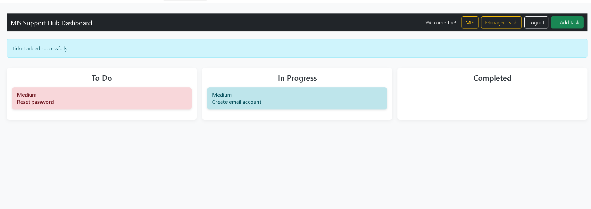

# SupportHub

A robust IT ticket management system designed to streamline daily operations and team communication.

## 📌 Overview
SupportHub allows employees to submit IT requests, while providing managers and admins with powerful tools to track, update, and automate workflow via a Kanban-style interface.

## 🚀 Features

* **Kanban Workflow:** Track tickets through `New`, `In Progress`, and `Completed` stages with AJAX-powered drag-and-drop.
* **Smart Automation:** 
    * **Google Calendar API:** Automatic reminder creation for deadlines.
    * **Cron Jobs:** A dedicated Docker container polls the DB to trigger real-time email notifications.
* **Multi-Level Access Control:** 
    * **Manager Portal:** Real-time team oversight and user management.
    * **Admin Portal:** RBAC (Role-Based Access Control) and system-wide security settings.
* **Advanced Search:** Live and filtered searching by department, status, or manager.
* **Persistent Sessions:** Server-side session management for secure state persistence and flash messaging.

## 🛠 Tech Stack

### Backend & Frontend
- **Languages:** PHP, JavaScript (ES6+), HTML5, CSS3
- **Libraries:** jQuery (AJAX interactions)
- **Architecture:** MVC (Model-View-Controller)

### Infrastructure & Tools
- **Containerization:** Docker, Docker Compose
- **APIs:** Google Calendar API, RESTful CRUD
- **Version Control:** Git

## 📦 Installation & Setup

1. **Clone the repository:**
   
    - git clone [https://github.com/JoeMuldowney/SupportHub.git](https://github.com/JoeMuldowney/SupportHub.git)

2. **Environment Configuration**

- Create a folder named "secrets" in the root directory and configure the following:

    - DB_HOST=
    - DB_NAME=
    - DB_USER=
    - DB_PASSWORD=
    - DB_ROOT_PASSWORD=
    - MAIL_HOST=
    - MAIL_PORT=

- Requires an account on Google developer and configuration of api and services from console to add the secret below.
    - calendar.json

3. **Create Temp User**
- For intial access update line 155 in db.sql with a temp password hash to login with as a admin user.

4. **Start Apllication**
- Run "docker-compose up --build" in project root.

## 📸 Visual Overview

  
   
  <em>Interactive Kanban board featuring drag-and-drop ticket management.</em>

---